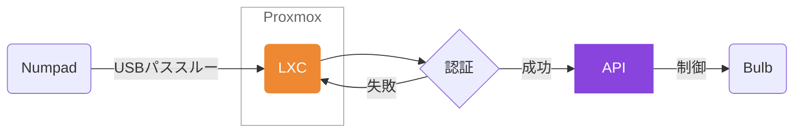

# 💭 テンキーで部屋の明かりを操作したい

SwitchBotのスマート電球はSiriなどで操作できますが、急いでいるときは言うまでもなく非常に不便です。
純正のリモートボタンも別売りであるのですが、2パターンしか操作することができません。
テンキーで操作できたらいいなと思い作りました。

# 構成

- サーバ
    - Proxmoxで立てたLXC(コンテナ)

- API
    - SwitchBot API v1.1

- 動かすモノ
    - [SwitchBot LED電球 スマートライト](https://amzn.asia/d/2sgF1ad)

# 🛠 準備をしよう

## 購入したもの

### 本体に割り当て保存可能なミニキー
急いでいる時に操作を素早くしたい用に。部屋の入り口付近に設置します。
ちなみにキースイッチを自由に取り外せるので、余っているルブ済みのキーに取り替えました。

### BUFFALO BSTK100WH
とりあえず安いので...。

