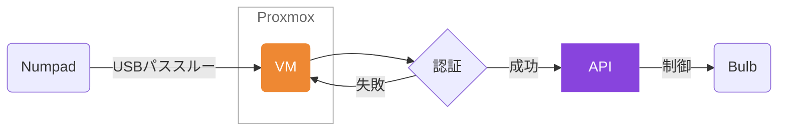

# 💭 テンキーで部屋の明かりを操作したい

SwitchBotのスマート電球はSiriなどで操作できますが、急いでいるときは言うまでもなく非常に不便です。
純正のリモートボタンも別売りであるのですが、2パターンしか操作することができません。
テンキーで操作できたらいいなと思い作りました。

# 構成

- スイッチとなるモノ
  - ミニキー
  - BUFFALO BSTK100WH

- サーバ
  - Proxmoxにて作成したVM (Debian GNU/Linux 12)

- API
  - [SwitchBot API v1.1](https://github.com/OpenWonderLabs/SwitchBotAPI)

- 動かすモノ
  - [SwitchBot LED電球 スマートライト](https://amzn.asia/d/2sgF1ad)




# 🛠 準備をしよう

## スイッチとなるモノ

### 本体に割り当て保存可能なミニキー
急いでいる時に操作を素早くしたい用に。部屋の入り口付近に設置します。
ちなみにキースイッチは自由に取り外せるので、余っているルブ済みのキーに取り替えました。
かわいいね。
[](https://amzn.asia/d/cAe0HA2)

### BUFFALO BSTK100WH
とりあえず安いので...。
[](https://amzn.asia/d/8Nt3GOu)

## サーバ

LXC (Linux Container) にしようかと思いましたが、
試行錯誤をしてもUSBパススルーがうまく設定できないので、
おとなしくDebianのVMを立てることにします。スペックは1CPUの512MBで問題ありません。

### USBパススルー
VMを作成したらWebGUIからUSBパススルーの設定を行います。(CLIからもできますが、割愛)
`当該VM` → `ハードウェア` → `追加` → `USBデバイス` → `USBポートを使用` → `プルダウンからUSB機器を選択する`

### 自動をログインを有効化
もしVMがシャットダウンされたら起動時に手動でログインする必要があるため
TTY1の設定をいじくります。

```sh
sudo nano /etc/systemd/system/getty.target.wants/getty@tty1.service
```
```:/etc/systemd/system/getty.target.wants/getty@tty1.service
[Service]
ExecStart=
ExecStart=-/sbin/agetty --autologin {user name} --noclear %I $TERM
```
```sh
sudo reboot
```

### Pythonスクリプト

#### get_data.py
実行するとトークンを求められます。
成功するとdeviceID, SceneIDを取得します。
https://github.com/gaimo-ch/Control-SwitchBot/blob/main/get_data.py

#### ctrl_scene.py
テンキーから入力があれば、API経由でシーンを制御します。
https://github.com/gaimo-ch/Control-SwitchBot/blob/main/ctrl_scene.py

