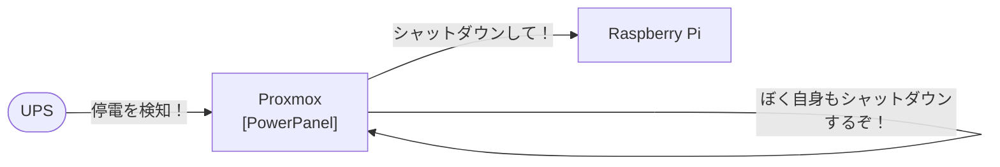

[CyberPowerの無停電電源装置](https://www.cyberpower.com/jp/ja/product/sku/cp750pfclcd_jp)を購入したので、常時稼働しているおうちサーバに導入します。

# 構成



UPSが停電を検知したら、Proxmoxに常駐しているPowerPanelが検知して、Raspberry Piに`poweroff`コマンドをSSHで送ります。

# 🛠 準備をしよう

## Proxmox

Proxmox上のホストOSに[PowerPanel for Linux 64bit (deb)](https://www.cyberpower.com/jp/ja/product/sku/powerpanel_for_linux#overview)をダウンロードします。

下記のコマンドでインストールします。

```sh
sudo apt install ./CyberPower_PPL_Linux+64bit+(deb)_vバージョン.deb
```

下記のコマンドでステータスを表示します。

```sh
sudo pwrstat -status
```

```sh
The UPS information shows as following:

        Properties:
                Model Name................... CP750PFCLCD JP
                Firmware Number.............. CR02207B5I13
                Rating Voltage............... 100 V
                Rating Power................. 525 Watt(750 VA)

        Current UPS status:
                State........................ Normal
                Power Supply by.............. Utility Power
                Utility Voltage.............. 96 V
                Output Voltage............... 96 V
                Battery Capacity............. 100 %
                Remaining Runtime............ 13 min.
                Load......................... 168 Watt(32 %)
                Line Interaction............. None
                Test Result.................. Unknown
                Last Power Event............. None
```

デフォルトだと、停電後に復旧しても規定の時間にUPS自体がシャットダウンされてしまうので、
`/etc/pwrstatd.conf`内の以下の部分を変更します。

```diff sh:/etc/pwrstatd.conf
-    turn-ups-off = yes
+    turn-ups-off = no
```

停電を検知すると`/etc/shutdown.sh`を実行してシステムをシャットダウンするようです。
